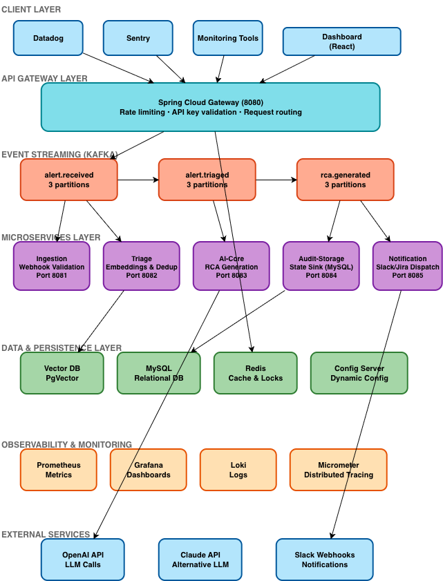

# Resolve AI ⚡

**Enterprise-grade event-driven AIOps platform built using Spring Boot microservices, Apache Kafka, Spring AI, and vector databases for automated support ticket triage and Root Cause Analysis (RCA).**


<br>



---

## 1. Project Overview

**Project Name**

Resolve AI

**Problem Statement**

Modern engineering and support teams suffer from alert fatigue. Traditional incident management systems struggle when alert ingestion, duplicate checking, log correlation, and root cause analysis are done manually, leading to high Mean Time to Resolution (MTTR).

**Why This Application Was Built**

This project was built to demonstrate production-style AI integration within a distributed backend architecture for a senior backend role, including:

* service decomposition
* event-driven messaging via Apache Kafka
* Retrieval-Augmented Generation (RAG) pipelines
* LLM-based classification and confidence routing
* containerized deployment and observability

**High-Level Objective**

Deliver an autonomous AI-driven platform that ingests high-volume system alerts, semantically checks for duplicate incidents, classifies severity, and generates actionable Root Cause Analysis (RCA) reports for engineers.

**Business Value**

* drastically reduced MTTR via automated initial triage
* elimination of redundant ticket tracking using vector embeddings
* scalable handling of alert spikes via Kafka event queues
* cleaner security boundary through API gateway routing

---

## 2. Project Description

**What the Application Does**

Resolve AI supports the end-to-end incident lifecycle:

* automated webhook ingestion of alerts from monitoring tools
* semantic deduplication against historical tickets using vector search
* LLM-driven classification (Severity, Domain, Blast Radius)
* context enrichment (RAG) by fetching related system logs
* automated RCA draft generation using Spring AI
* event-driven notification dispatch to engineering teams

**Main User Journey**

1. Monitoring tool (e.g., Datadog) triggers an alert webhook to the API Gateway.
2. Ingestion service validates the payload and publishes the raw event to Kafka.
3. Triage service consumes the event, converts it to a vector embedding, and queries the Vector DB for duplicates.
4. If unique, the AI Core service classifies the issue's severity and domain.
5. AI Core service uses Spring AI to generate a detailed RCA summary based on retrieved context.
6. Audit service persists the state, and the Notification service pushes the RCA draft to a Slack channel.

**Core Modules**

* Ingress routing and rate limiting (api-gateway)
* Alert webhook validation and publishing (ingestion)
* Semantic search and deduplication (triage)
* LLM reasoning and RAG orchestration (ai-core)
* Relational state persistence and auditing (audit-storage)
* Alert dispatching (notification)
* Infra: Apache Kafka, MySQL, Vector DB, Redis


## 3. Architecture Overview


**High-Level Architecture**

* **API Gateway:** Single ingress point, API key validation, and route-level rate limiting.
* **Domain Services:** 5 independent Spring Boot microservices (Ingestion, Triage, AI-Core, Audit, Notification).
* **Datastores:** 
  * **MySQL:** Relational persistence for ticket states, RCAs, and audit trails.
  * **Vector Database:** Stores high-dimensional text embeddings for semantic deduplication.
  * **Redis:** In-memory caching for API Gateway rate-limiting.
* **Messaging:** Apache Kafka handles high-throughput event ingestion and decouples the AI processing pipeline.
* **AI Integration:** Spring AI / LangChain4j orchestrates LLM classification and RAG pipelines.
* **Observability:** Spring Boot Actuator, Micrometer, Prometheus, and Grafana for metrics and Kafka lag monitoring.

**Request Lifecycle**

1. Monitoring tool (Client) sends an alert payload to `api-gateway`.
2. Gateway validates API keys and forwards the request to the `ingestion-service`.
3. `ingestion-service` immediately publishes the raw event to the Kafka topic (`alert.received`) and returns a 202 Accepted response to prevent timeouts.
4. `triage-service` consumes the event, generates embeddings, queries the Vector DB for duplicates, and publishes to `alert.triaged`.
5. `ai-core-service` consumes the triaged event, builds the prompt context, calls the LLM for RCA generation, and publishes to `rca.generated`.
6. `audit-storage` independently listens to all Kafka topics to maintain a real-time state machine in MySQL.

**Sync vs Async Communication**

* **Synchronous (OpenFeign / REST):** Dashboard read operations (e.g., fetching ticket history and final RCA summaries from the audit service).
* **Asynchronous (Apache Kafka):** The core event pipeline. Decouples fast webhook ingestion from potentially slow, rate-limited LLM API calls.

**Architectural Decisions**

* **Event-driven ingestion** ensures that spikes in monitoring alerts do not crash the system or cause webhook timeouts while waiting for LLM processing.
* **Vector-based deduplication** handles slight variations in error messages and stack traces much better than exact string matching.
* **CQRS Pattern:** The system separates the write/command path (Kafka event streams) from the read/query path (MySQL audit database).
* **Gateway-centric security** offloads API key validation, keeping internal microservices focused purely on business logic.


## 4. Tech Stack Documentation

### Backend

| Technology | What it is | Why chosen / Problem solved |
| :--- | :--- | :--- |
| **Java 21** | LTS JVM runtime | Modern language/runtime; uses Virtual Threads for high-throughput AI API calls. |
| **Spring Boot 3.4.x** | App framework | Rapid service bootstrap with production-ready actuator features. |
| **Spring AI** | AI integration framework | Standardized interface for LLM orchestration and Vector DB connectivity. |
| **Spring Cloud Gateway** | Reactive API gateway | Centralized routing, API key validation, and rate limiting. |
| **Apache Kafka** | Event streaming broker | Decouples webhook ingestion from slow LLM inference, ensuring no dropped alerts. |
| **OpenFeign** | Declarative HTTP client | Simple inter-service synchronous calls for dashboard reads. |
| **Spring Data JPA** | ORM | Relational domain persistence for audit trails. |
| **Flyway** | DB migration | Versioned schema changes for MySQL. |
| **Redis** | In-memory data store | Gateway rate limiting and short-term caching. |

### Database & Persistence

* **MySQL:** Maintains strong transactional consistency for ticket lifecycle, audit logs, and final RCA reports.
* **Vector Database (PgVector / Milvus):** Stores high-dimensional textual embeddings of error logs to perform rapid cosine-similarity searches for deduplication.

### Containerization & Build

* **Docker & Docker Compose:** Used for spinning up isolated dev, local, and observability stacks.
* **Maven:** Dependency management and build lifecycle.

### Observability

* **Prometheus:** Metrics scraping (Kafka lag, LLM latency).
* **Grafana:** Dashboards for visualizing system health and alert ingestion rates.
* **Micrometer + Actuator:** Standardized telemetry and health endpoints.

---

## 5. Complete Microservice Breakdown

| Service | Port | Purpose | Database | Key Dependencies |
| :--- | :--- | :--- | :--- | :--- |
| **api-gateway** | 8080 | Ingress routing, API Key validation, Rate limiting | Redis | - |
| **ingestion** | 8081 | Alert webhook validation and Kafka publishing | - | Kafka Producer |
| **triage** | 8082 | Generates embeddings, semantic duplicate checking | Vector DB | Kafka, Spring AI |
| **ai-core** | 8083 | LLM classification, RAG context building, RCA generation | - | Kafka, Spring AI, LLM API |
| **audit-storage**| 8084 | Persists state changes and RCA results via JPA | MySQL | Kafka Consumer |
| **notification** | 8085 | Dispatches completed RCAs to Slack/Jira | - | Kafka Consumer |

---

## 6. API Documentation (Service-wise)

**Common Headers**

* `Authorization: Bearer <access_token>` or `X-API-Key: <key>` for protected dashboard or webhook ingress APIs.
* Gateway injects trusted internal headers: `X-Tenant-Id`, `X-Source-System`.

### Ingestion Service (`/api/v1/alerts`)

* Webhooks:
  * `POST /api/v1/alerts/ingest`
  * `GET /api/v1/alerts/status/{jobId}`
* Internal:
  * `POST /api/internal/alerts/requeue`

**Sample request (`POST /api/v1/alerts/ingest`):**
```json
{
  "source": "DATADOG",
  "service": "payment-gateway",
  "error_message": "Connection timeout acquiring database lock",
  "stack_trace": "com.mysql.cj.jdbc.exceptions.CommunicationsException...",
  "timestamp": "2026-09-08T10:00:00Z"
}
```

**Sample response:**
```json
{
  "success": true,
  "status": 202,
  "message": "Alert queued successfully",
  "data": {
    "jobId": "job_01J7A29M8X9N3R",
    "fingerprint": "fp_pay_npe_charge"
  },
  "timestamp": "2026-09-08T10:00:01Z"
}
```
